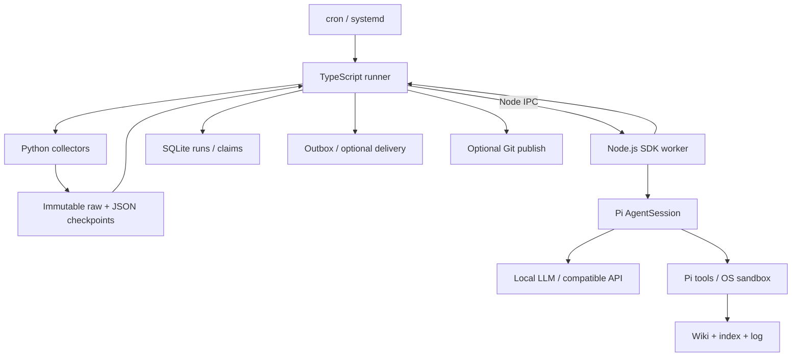

# 設計

## 実行構成

Node.js 24 の TypeScript アプリケーションです。`npm run build` で src/ を dist/ に
コンパイルし、`bin/wiki` が dist/cli.js を起動します。Python は情報収集・品質検査に使用します。
Pi SDK `@earendil-works/pi-coding-agent` の固定版を利用します。

| Module | 責務 |
|---|---|
| cli.ts / config.ts | コマンド、profile、manifest 検証、子プロセス環境 |
| runner.ts / schedule.ts | ジョブ順序、依存鮮度、UTC cron、catch-up |
| state.ts | Node 標準 SQLite、実行記録、claim、profile mutex |
| agent.ts / agent-worker.ts | worker 起動、IPC、deadline、終了処理 |
| sandbox.ts / sandbox-tools.ts / tool-worker.ts | bubblewrap、標準ツール委譲、検索・原文追加 broker |
| agent-session.ts | Pi SDK の model・resource・session 設定と実行 |
| results.ts | triage の出典同一性、backlog 完了記録の検証 |
| process.ts | collector / Git / 配信 subprocess の lifecycle |
| delivery.ts / search.ts / publish.ts | 通知、検索、Git 公開 |
| profile.ts / migrate.ts | profile 初期化、外部 collector state の import |
| scripts/ | 独立した Python collector / inspector |

## Pi SDK の責務

worker は `ModelRuntime` で provider/認証/model を読み、`createAgentSessionServices` と
`createAgentSession` で session を作ります。`DefaultResourceLoader` の options を通じて
skill・prompt・extension・共通指示を設定し、`SessionManager` が履歴を永続化します。
LLM API、tool calling、context compaction、モデルの自動 retry は Pi に任せます。

OpenAI provider は API key と Sign in with ChatGPT の双方を扱います。
native TUI の `/login openai` が profile の installation ID を使って認証し、
ModelRuntime が保存済み OAuth の再利用・refresh・永続化を担当します。
`allowModelNetwork: false` と `PI_OFFLINE` は起動時の catalog 更新等を停止する設定で、
明示した OAuth ログインやモデル接続を禁止するものではありません。
定期ジョブは local.json/job の provider・model を選ぶため、TUI の一時的な選択だけでは
ジョブの接続先は変わりません。設定例は README の ChatGPT プラン節を参照してください。

定期 task は `session.prompt()` の完了を待ち、session 内の最後の assistant message と
stopReason を検証。途中の失敗が Pi の retry で回復した場合も、最終状態で判定します。
message_end イベントから usage を集め、本文とは分けて保存。session ID/path も記録します。

worker はジョブ単位の独立プロセスです。起動時から profile HOME / 認証環境を設定するため、
親の process.env を書き換えずに SDK が profile の認証を使用します。
標準ツールは別の bubblewrap process 内で動き、環境変数は公開値だけの許可リストです。
IPC はアプリケーションの request/result を運び、モデルイベントの stdout 解析は行いません。
終了時は runtime.dispose()。timeout では SDK abort を要求し、終了しない worker を強制停止。
Pi tools の中断処理に加え、runner が管理する process group も終了させます。

`wiki pi` は同じ runtime factory を Pi SDK の `InteractiveMode` に渡します。
`AgentSessionRuntime` が `/new`・`/resume`・`/fork` 後の session と services を再構築。
対話モードにはジョブ用の時間制限を設けず、終了まで profile lock を保持します。

## パス・設定

| 対象 | 場所 |
|---|---|
| profile root | AI_TOPICS_PROFILE（省略時 checkout の profiles/lucy） |
| 子プロセス HOME | profile root |
| コンテンツ / canonical Wiki | ~/ai-topics / ~/wiki |
| Pi 設定 / 認証 | ~/.pi/agent |
| collectors の状態 | ~/.ai-topics/data、processed_*.json |
| 実行記録 / claim | ~/.ai-topics/runs.db |
| profile mutex | ~/.ai-topics/lock.db |
| 実行成果物 / Pi session / outbox | ~/.ai-topics/runs、sessions、outbox |
| scripts | checkout の scripts/（入口は wiki-script NAME.py） |

code checkout を移動したら profile/.ai-topics/scripts を新しい scripts/ へ張り替えます。
profile 移動時は AI_TOPICS_PROFILE と checkpoint 内の raw_path を確認します。
共通 Wiki 指示は config/AGENTS.md。祖先 directory や旧コンテンツの agent 設定を読み込まないよう
context-file 自動探索を停止し、system prompt に明示追加します。extension も明示指定です。
init は destination の AGENTS.md を設置し、原本を private state に保存します。

## 永続状態・失敗境界

- SQLite の別 connection / 別 lock.db で BEGIN IMMEDIATE を保持し、profile を排他。
  強制終了時も OS が lock を解放します。run / tick / interactive / publish は同じ mutex を取得。
  Pi から呼ぶ wiki-script は再入 lock を取りません。手動 collector と tick は併走させない。
- runs.db は実行 ID・開始/終了・結果・詳細を保存。claims は (job, slot) unique。
  session 履歴と業務の進行状態は別の責務です。
- UTC 5-field cron。日付/曜日は Vixie OR semantics。初回 tick は現在 minute から開始し、
  以後は保存 cursor から追いつきます。既定24時間を超える欠落は停止してレビューを求めます。
- upstream の最新成功と鮮度を確認。triage より新しい collector があれば後続を止めます。
  triage JSON は checkpoint ID・候補網羅・一意性を検証し、URL/raw_path は入力から付与。
  nightly theme に未知の URL が混ざれば拒否。backlog は全記事の完了記録を検証。
- collector は JSON stdout / stderr logs / nonzero failure。exit 0 の ok:false も失敗です。
- crash 後の running 行は recover RUN_ID するまで run/tick を止めます。
  claim と外部副作用を跨ぐ exactly-once は保証せず、無条件の自動再実行はしません。
- 失敗時に途中の Wiki 編集を自動 rollback しません。Git diff と run artifacts を確認します。
- 通知 / push は独立して再試行。通知は at-least-once で run ID を添付します。

## 拡張・権限

新 source は独立 collector、新 task は manifest + prompt、agent の機能追加は Pi extension。
WIKI_SEARCH_COMMAND は JSON argv、通知 route も argv と stdin envelope の明示契約です。
SDK integration test は追加 extension の実 tool call と結果受渡しも検証します。

Pi SDK はホストで認証とモデル通信を扱い、read/write/edit/bash/grep/find/ls は
bubblewrap 内の worker へ委譲します。Pi 標準ツールの schema と処理をそのまま使い、
独自 agent loop は実装しません。対話の !/!! も同じ境界です。PowerShell は無効です。
公開コード・依存・checkpoint は読み取り専用、Wiki と専用 scratch は書込み可能。
raw/transcripts は読み取り専用、triage/grouping/wiki-health では Wiki 全体も読み取り専用です。
認証、secrets、local 設定、DB、session、Git metadata はマウントしません。
調査ジョブだけ tool 通信を許可し、web_search が検索キーをホストで使用します。
save_raw は新規記事だけを排他的に作成します。sandbox 起動失敗時は停止します。
明示 extensions、収集・通知・公開コードは信頼済みホストコードであり、この境界の外です。
Pi sessions と collector state は private artifact。run logs の既知の secret 値はマスクします。
Git 公開は wiki/ に限定し、既存 staged 変更があれば停止。コンテンツの hooks を実行します。
