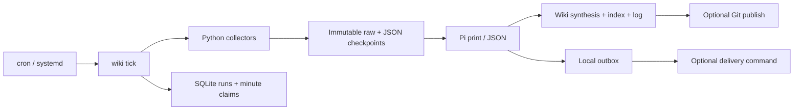

# 設計

## 境界

Pi を長期接続した server として包まず、1 task = 1 Pi CLI process にします。
Pi の tools、provider、context compaction、session JSONL を再実装しません。
`--mode json --print` の完了イベントと assistant stopReason を確認し、途中切断・API
エラー・出力上限到達を成功として扱いません。実測 usage は final response とは別に保存。

既存 ai-topics-agent の multi-harness adapter、Hermes ABI、asset 配布/sync 層、常駐
scheduler、gateway、バックアップ形式は持ち込みません。共有したのは収集・品質検査の
ドメインコードと実行ロック/記録の考え方です。移植元の hash は source-inventory.json。
30ジョブを維持しながら、報告だけの LLM 呼出しを script-only に置き換えています。

## パス

| 対象 | 場所 |
|---|---|
| profile root | `AI_TOPICS_PROFILE`（省略時 checkout の profiles/lucy） |
| 子プロセス HOME | profile root（operator の HOME は変更しない） |
| コンテンツ | `~/ai-topics` |
| canonical Wiki | `~/wiki`（content Wiki への相対 symlink） |
| Pi 設定 / 認証 | `~/.pi/agent` |
| collectors の状態 | `~/.ai-topics/data`、`processed_*.json` |
| 実行記録 / 結果 / outbox | `~/.ai-topics/runs.db`、`runs/`、`outbox/` |
| Pi sessions | `~/.ai-topics/sessions/` |
| 保守 script | code checkout の scripts/、呼出しは `wiki-script NAME.py` |

code checkout が移動したら profile/.ai-topics/scripts の symlink を新 scripts/ に
張り替えてください。profile 移動時は `AI_TOPICS_PROFILE` と checkpoint 内の raw_path も
確認します。run artifacts は過去時点の記録として保持します。
モデルの API 接続や認証は runner の独自設定へ複製しません。

## 実行と失敗

- profile 全体を flock で排他。run / tick / interactive Pi / publish は同じロックを使用。
  `wiki-script` は Pi 内から呼ぶため再入ロックを取りません。手動 collector と tick の併走は不可。
- UTC 5-field cron。曜日/日付は Vixie OR semantics。日付 step `*/2` は暦の月初基準。
- tick は永続 minute cursor と (job, slot) unique claim を持ち、同一 slot を再実行しません。
  初回は現在の minute から開始。次回は前回から追いつきます。24時間を超える欠落は停止。
  長時間ジョブ中の起動は busy となり、後続 tick が追いつきます。
- upstream の最新実行が成功し、26時間以内であることを確認。さらに triage より新しい
  collector がないことも確認。失敗/古い triage を過去の成功で隠しません。
- collector は stdout JSON / stderr logs / nonzero failure。exit 0 の `ok:false` も失敗。
  script と Pi の timeout は process group 全体へ適用。強制終了時の running 行は、
  人が artifacts を確認し `recover RUN_ID` するまで定期実行を停止します。
- scheduled claim は at-most-once。外部副作用と SQLite を跨ぐ exactly-once は保証しません。
  claim 直後の crash で未実行 slot が残ることがあります。status と artifacts を確認し手動再実行。
- blog/newsletter triage は checkpoint ID と全候補の一意な決定を検証。
  URL/raw_path は collector の入力から付与。nightly themes の URL も入力に限定します。
- structured result は成功した run の response.md（中身は JSON）から直接渡します。
  scheduler 固有 ID と Markdown の Response セクションの解析はありません。
- 失敗は作業中のファイル編集を自動 rollback しません。Git diff を確認して再実行してください。

## Pi context と拡張

`config/AGENTS.md` を明示的に system prompt へ追加。旧コンテンツの AGENTS.md や
祖先 directory の Hermes 設定を誤読しないよう context-file 自動探索を止めています。
init は destination clone の AGENTS.md を Pi 版に置換し、旧版を private state に保存。
自動探索による extension 起動も止め、必要な extension は `pi.extensions` で明示します。
skills は Pi 標準読み込み、prompt は Markdown。cron manifest が workflow の唯一の定義です。
自動実行と同じ挙動の対話入口は `bin/wiki pi` です。

新 job の `script`、`prompt`、`skills`、`depends_on`、`schedule` を追加し validate。
collector helper は単独でも通常の Python として利用できます。
`wiki-search` は BRAVE_API_KEY または WIKI_SEARCH_COMMAND（JSON argv）を使い、検索先を分離。
`wiki-deliver` は任意コマンドへ置換可能。Pi extension で追加 tools も登録できます。

## 運用上の制約

Pi/bash は OS と同じ権限を持ちます。prompt は sandbox ではなく、profile 内の秘密情報を
モデルの tool から技術的に隠す境界もありません。分離が必要なら別 OS user/container と
秘密注入を分けてください。通常の transcript に秘密値を書かない設定を維持します。
公開ログでは環境の key/token/password 値をマスクしますが Pi session は private artifact。

通知は at-least-once。送信後に crash すると重複し得るため run ID を添付。
Git 公開は wiki/ のみで既存 staged 変更があれば拒否。hooks を無効化しません。
source content repository 由来の shell hooks は別のコード依存として確認してください。
無人公開は opt-in。profile の Git identity、credential helper、SSH 等は個別設定が必要です。
